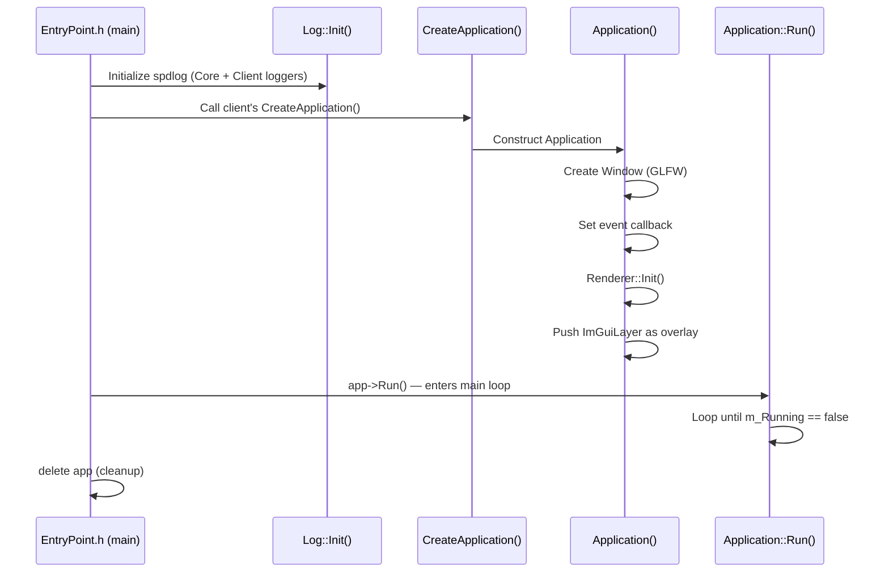
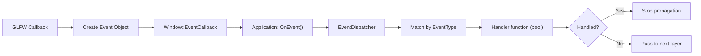
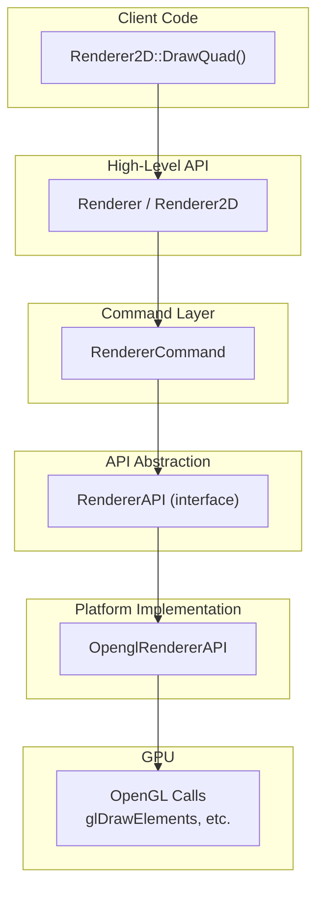
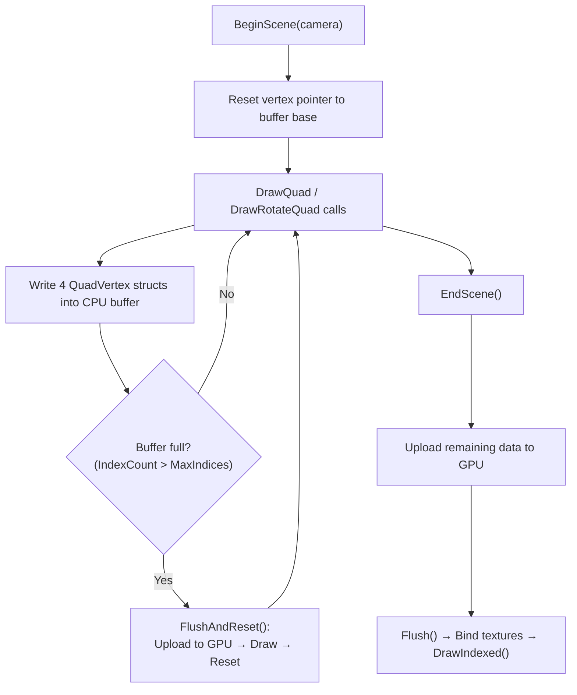
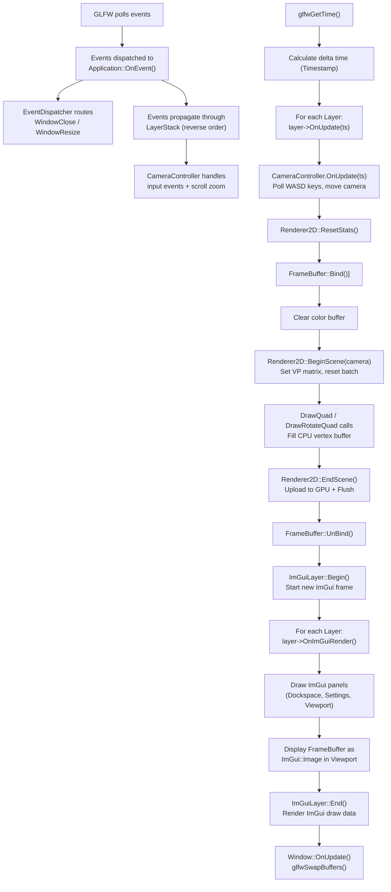

# 🎮 Shunya Game Engine — Full Architecture Walkthrough

> [!NOTE]
> **Shunya** (शून्य — "zero/void" in Sanskrit) is a custom C++ game engine built from scratch using OpenGL. This document explains every subsystem and how they all connect.

---

## 1. High-Level Project Structure

```
Shunya/
├── premake5.lua              # Build system — generates VS solution
├── Shunya.sln                # Generated Visual Studio solution
├── Project_Generation.bat    # Runs premake to regenerate projects
│
├── Shunya-Core/              # 🧠 The Engine Library (Static Lib)
│   ├── src/
│   │   ├── Shunya.h          # Umbrella header — includes everything
│   │   ├── SNY-PCH.h/cpp     # Precompiled header
│   │   └── Core/             # All engine subsystems
│   └── third_party/          # GLFW, Glad, ImGui, GLM, spdlog, stb_image
│
├── PlayGround/               # 🎯 Sandbox Application (Console App)
│   ├── src/
│   │   ├── PlayGround.cpp    # Entry point (includes EntryPoint.h)
│   │   └── Sandbox2D.h/cpp   # Demo layer with 2D rendering
│   └── assets/               # Shaders, textures
│
├── Shunya-Editor/            # ✏️ Editor Application (Console App)
│   └── src/
│       ├── ShunyaEditor.cpp  # Entry point
│       └── EditorLayer.h/cpp # Editor with dockspace + viewport
│
├── third_party/              # Top-level dependencies (bin outputs)
├── bin/                      # Build output
└── bin-int/                  # Intermediate build files
```

### Three Projects, One Solution

| Project | Type | Purpose |
|---------|------|---------|
| **Shunya-Core** | Static Library (.lib) | The engine itself — all systems live here |
| **PlayGround** | Console Application | A sandbox app for testing the engine |
| **Shunya-Editor** | Console Application | An ImGui-based editor with viewport |

Both `PlayGround` and `Shunya-Editor` **link against** `Shunya-Core` and use the engine through the single umbrella header `Shunya.h`.

---

## 2. Build System — Premake5

The engine uses **Premake5** to generate Visual Studio project files. Key details:

- **Architecture:** x64 only (x86 is explicitly rejected in [Core.h](file:///a:/Projects/Shunya/Shunya-Core/src/Core/Core.h))
- **C++ Standard:** `C++latest`
- **Runtime:** Static runtime (`/MD` for Release, `/MDd` for Debug)
- **Configurations:** `Debug`, `Release`, `Dist`
- **Precompiled Header:** [SNY-PCH.h](file:///a:/Projects/Shunya/Shunya-Core/src/SNY-PCH.h)

### Third-Party Dependencies (Git Submodules)

| Library | Purpose |
|---------|---------|
| **GLFW** | Window creation, input, OpenGL context |
| **Glad** | OpenGL function loader |
| **ImGui** | Immediate-mode GUI (editor panels) |
| **GLM** | Math library (vectors, matrices, transforms) |
| **spdlog** | Fast logging framework |
| **stb_image** | Image loading for textures |

---

## 3. Engine Boot Sequence

The entire startup is orchestrated by a clever pattern where the engine defines `main()` and the client just defines a factory function:



### How It Works

1. **[EntryPoint.h](file:///a:/Projects/Shunya/Shunya-Core/src/Core/EntryPoint.h)** defines `main()` inside the engine — the client never writes `main()` themselves
2. The client (PlayGround or Editor) implements `Shunya::CreateApplication()` to return their custom `Application` subclass
3. Profiling sessions wrap startup, runtime, and shutdown for performance analysis

---

## 4. The Application Class — The Heart

[Application.h](file:///a:/Projects/Shunya/Shunya-Core/src/Core/Application.h) | [Application.cpp](file:///a:/Projects/Shunya/Shunya-Core/src/Core/Application.cpp)

The `Application` is a **singleton** and owns:

| Member | Type | Role |
|--------|------|------|
| `m_Window` | `unique_ptr<Window>` | The OS window (GLFW implementation) |
| `m_LayerStack` | `LayerStack` | Ordered collection of layers + overlays |
| `m_ImGuiLayer` | `imGUILayer*` | The ImGui overlay (always on top) |
| `m_Running` | `bool` | Controls the main loop |
| `m_Minimized` | `bool` | Skips rendering when minimized |
| `m_LastTimeFrame` | `float` | For delta-time calculation |

### The Main Loop (`Run()`)

```
while (m_Running):
    1. Calculate delta time (timestep)
    2. If NOT minimized:
       a. For each layer → layer->OnUpdate(timestep)     // Game logic + rendering
       b. ImGuiLayer->Begin()
       c. For each layer → layer->OnImGuiRender()        // Draw ImGui panels
       d. ImGuiLayer->End()
    3. m_Window->OnUpdate()                              // Poll events + swap buffers
```

> [!IMPORTANT]
> The rendering and the ImGui rendering are **two separate passes**. First all layers do their OpenGL rendering in `OnUpdate()`, then all layers draw their ImGui panels in `OnImGuiRender()`.

---

## 5. Layer System

[Layer.h](file:///a:/Projects/Shunya/Shunya-Core/src/Core/Layer.h) | [LayerStack.h](file:///a:/Projects/Shunya/Shunya-Core/src/Core/LayerStack.h)

Layers are the primary way to organize engine functionality. Each layer has these virtual methods:

```cpp
virtual void OnAttach() {}      // Called when pushed to stack
virtual void OnDetch() {}       // Called when removed (note: "Detach" typo)
virtual void OnUpdate(Timestamp ts) {}    // Called every frame
virtual void OnImGuiRender() {}           // Draw ImGui panels
virtual void OnEvent(Event& event) {}     // Handle events
```

### Layer vs Overlay

- **Layers** — pushed to the *front* of the stack (game layers, 2D sandbox, etc.)
- **Overlays** — pushed to the *back* of the stack (ImGui is always an overlay)

**Event propagation** goes in **reverse order** (overlays first → layers last). If an overlay handles an event (`Handled = true`), layers beneath never see it.

---

## 6. Event System

```
Events/
├── Event.h               # Base Event class + EventDispatcher
├── KeyEvent.h             # KeyPressedEvent, KeyReleasedEvent, KeyTypedEvent
├── MouseEvent.h           # MouseMoved, MouseScrolled, MouseButton events
└── ApplicationEvent.h     # WindowClose, WindowResize events
```

### Architecture



### Key Design Decisions

- **Type-safe dispatch** using `EventDispatcher::Dispatch<T>()` with static type checking via `GetStaticType()`
- **Category flags** use bitfields: `BIT(0)` for Application, `BIT(1)` for Input, etc.
- **Macro helpers**: `EVENT_CLASS_TYPE(type)` and `EVENT_CLASS_CATEGORY(category)` reduce boilerplate

Example from Application:
```cpp
void Application::OnEvent(Event& e) {
    EventDispatcher dispatcher(e);
    dispatcher.Dispatch<WindowClosedEvent>(BIND_FUN(OnWindowClose));
    dispatcher.Dispatch<WindowResizeEvent>(BIND_FUN(OnWindowResize));
    
    // Propagate to layers in reverse order
    for (auto it = m_LayerStack.end(); it != m_LayerStack.begin(); )
        (*--it)->OnEvent(e);
}
```

---

## 7. Window Abstraction

[Window.h](file:///a:/Projects/Shunya/Shunya-Core/src/Core/Window.h) | [WindowMaker.h](file:///a:/Projects/Shunya/Shunya-Core/src/Core/WindowMaker.h)

The `Window` class is an **abstract interface** — the engine code never touches GLFW directly (except inside `WindowMaker`).

| Abstract | GLFW Implementation |
|----------|-------------------|
| `Window` | `WindowMaker` |
| `Window::Create()` | Returns `new WindowMaker(props)` |
| `GetBreadth()` / `GetHeight()` | GLFW window dimensions |
| `SetVSync()` | `glfwSwapInterval()` |
| `OnUpdate()` | `glfwPollEvents()` + `glfwSwapBuffers()` |
| `GetNativeWindow()` | Returns the `GLFWwindow*` |

Default window: **1280×720**, title "Shunya".

---

## 8. Rendering Architecture

This is the most sophisticated part of the engine. It uses a **multi-layered abstraction**:



### RendererAPI — The Abstract Interface

[RendererAPI.h](file:///a:/Projects/Shunya/Shunya-Core/src/Core/Rendered/RendererAPI.h)

Defines an enum for **future API support**:
```cpp
enum class API { None = 0, OpenGL = 1, DirectX12 = 2, Vulkan = 3, Metal = 4 };
```

Currently only OpenGL is implemented, but the abstraction is ready for more backends.

### RendererCommand — Static Facade

[RendererCommand.h](file:///a:/Projects/Shunya/Shunya-Core/src/Core/Rendered/RendererCommand.h)

A thin static wrapper that delegates to the active `RendererAPI*`:
- `SetClearColor()` → `s_RendererAPI->SetClearColor()`
- `Clear()` → `s_RendererAPI->Clear()`
- `DrawIndexed()` → `s_RendererAPI->DrawIndexed()`
- `SetViewport()` → `s_RendererAPI->SetViewport()`

### Renderer — Scene-Level 3D Renderer

[Renderer.h](file:///a:/Projects/Shunya/Shunya-Core/src/Core/Rendered/Renderer.h)

Manages the **view-projection matrix** for a scene:
```cpp
Renderer::BeginScene(camera);  // Stores VP matrix
Renderer::Submit(shader, vertexArray, transform);  // Draw with shader
Renderer::EndScene();
```

### Renderer2D — Batch 2D Renderer ⭐

[Renderer2D.h](file:///a:/Projects/Shunya/Shunya-Core/src/Core/Rendered/Renderer2D.h) | [Renderer2D.cpp](file:///a:/Projects/Shunya/Shunya-Core/src/Core/Rendered/Renderer2D.cpp)

This is the **star of the engine** — a fully batched 2D quad renderer:

| Constant | Value | Purpose |
|----------|-------|---------|
| `MaxQuads` | 10,000 | Max quads per draw call |
| `MaxVertices` | 40,000 | 4 vertices per quad |
| `MaxIndices` | 60,000 | 6 indices per quad (2 triangles) |
| `MaxTextureSlots` | 32 | GPU texture unit limit |

#### Per-Vertex Data (`QuadVertex`):
```cpp
struct QuadVertex {
    glm::vec3 Position;
    glm::vec2 TexCoord;
    glm::vec4 Color;
    float TexIndex;       // Which texture slot (0 = white)
    float TilingFactor;
};
```

#### How Batching Works:



#### Texture Slot Management:
- Slot 0 is always a **1×1 white texture** (used for solid-color quads)
- When a textured quad is drawn, the renderer checks if the texture is already bound
- If not, it assigns the next available slot
- When all 32 slots are used, it flushes and resets

#### Draw API:
```cpp
// Colored quads
DrawQuad(position, size, color);

// Textured quads
DrawQuad(position, size, texture, tilingFactor, tintColor);

// Rotated variants
DrawRotateQuad(position, rotation, size, color);
DrawRotateQuad(position, rotation, size, texture, tilingFactor, tintColor);
```

#### Render Statistics:
The renderer tracks per-frame stats:
- Draw call count
- Quad count
- Total vertex count
- Total index count

---

## 9. GPU Resource Abstractions

### Buffers

[Buffer.h](file:///a:/Projects/Shunya/Shunya-Core/src/Core/Rendered/Buffer.h)

| Class | Purpose |
|-------|---------|
| `VertexBuffer` | Stores vertex data (position, color, UVs, etc.) |
| `IndexBuffer` | Stores triangle indices |
| `BufferLayout` | Describes the vertex attribute layout |
| `BufferElement` | Single attribute (type, name, offset, size) |

The `ShaderDataType` enum supports: `Float`, `Float2`, `Float3`, `Float4`, `Mat3`, `Mat4`, `Int`, `Int2`, `Int3`, `Int4`, `Bool`.

### Vertex Array

[VertexArray.h](file:///a:/Projects/Shunya/Shunya-Core/src/Core/Rendered/VertexArray.h)

Wraps an OpenGL **VAO** (Vertex Array Object), binding vertex buffers and index buffers together.

### Shader

[Shader.h](file:///a:/Projects/Shunya/Shunya-Core/src/Core/Rendered/Shader.h)

Abstract shader interface with:
- `Create(filepath)` — loads from `.glsl` file
- `Create(name, vertexSrc, fragmentSrc)` — from strings
- Uniform setters: `SetInt`, `SetFloat`, `SetFloat3`, `SetFloat4`, `SetMat4`, `SetIntArray`

A **ShaderLibrary** class provides named storage and retrieval of shaders.

### Texture

[Texture.h](file:///a:/Projects/Shunya/Shunya-Core/src/Core/Rendered/Texture.h)

- `Texture2D::Create(filepath)` — loads from image file using stb_image
- `Texture2D::Create(width, height)` — creates empty texture (for white texture)
- `SetData()` — upload raw pixel data
- Supports `operator==` for texture comparison in the batcher

### FrameBuffer

[FrameBuffer.h](file:///a:/Projects/Shunya/Shunya-Core/src/Core/Rendered/FrameBuffer.h)

Off-screen render target used by the **Editor Viewport**:
- `FramebufferSpecification`: Width, Height, Samples (MSAA), SwapChainTarget
- `GetColorAttachmentRendererID()` — returns the texture ID for ImGui display

---

## 10. OpenGL Backend

All OpenGL-specific implementations live in `Core/openGL/`:

| Abstract | OpenGL Implementation | File |
|----------|----------------------|------|
| `RendererAPI` | `OpenglRendererAPI` | [OpenglRendererAPI.cpp](file:///a:/Projects/Shunya/Shunya-Core/src/Core/openGL/OpenglRendererAPI.cpp) |
| `VertexBuffer` | `OpenGLVertexBuffer` | [OpenglBuffer.cpp](file:///a:/Projects/Shunya/Shunya-Core/src/Core/openGL/OpenglBuffer.cpp) |
| `IndexBuffer` | `OpenGLIndexBuffer` | [OpenglBuffer.cpp](file:///a:/Projects/Shunya/Shunya-Core/src/Core/openGL/OpenglBuffer.cpp) |
| `VertexArray` | `OpenGLVertexArray` | [OpenGLVertexArray.cpp](file:///a:/Projects/Shunya/Shunya-Core/src/Core/openGL/OpenGLVertexArray.cpp) |
| `Shader` | `OpenGLShader` | [OpenGLShader.cpp](file:///a:/Projects/Shunya/Shunya-Core/src/Core/openGL/OpenGLShader.cpp) |
| `Texture2D` | `OpenGLTexture2D` | [OpenGLTexture.cpp](file:///a:/Projects/Shunya/Shunya-Core/src/Core/openGL/OpenGLTexture.cpp) |
| `FrameBuffer` | `OpenGLFrameBuffer` | [OpenGLFrameBuffer.cpp](file:///a:/Projects/Shunya/Shunya-Core/src/Core/openGL/OpenGLFrameBuffer.cpp) |
| `GraphicsContext` | `OpenGLContext` | [OpenGLContext.cpp](file:///a:/Projects/Shunya/Shunya-Core/src/Core/openGL/OpenGLContext.cpp) |

This separation means you could add a **Vulkan** or **DirectX12** backend by creating new implementations without touching any engine or client code.

---

## 11. Camera System

### OrthographicCamera

[OrthographicCamera.h](file:///a:/Projects/Shunya/Shunya-Core/src/Core/Rendered/OrthographicCamera.h)

A simple 2D camera storing:
- Position and Rotation
- Projection matrix (orthographic)
- View matrix (inverse of camera transform)
- Pre-computed **ViewProjection matrix** (Projection × View)

### OrthographicCameraController

[OrthographicCameraController.h](file:///a:/Projects/Shunya/Shunya-Core/src/Core/OrthographicCameraController.h)

Adds **interactivity** to the camera:
- WASD movement (via `Input::IsKeyPressed()`)
- Mouse scroll zoom (via `MouseScrolledEvent`)
- Optional rotation
- Translation speed scales with zoom level
- Handles window resize to maintain aspect ratio

---

## 12. Input System

[input.h](file:///a:/Projects/Shunya/Shunya-Core/src/Core/input.h) | [WindowsInput.cpp](file:///a:/Projects/Shunya/Shunya-Core/src/Core/WindowsInput.cpp)

A **polling-based** input system (complements the event system):
```cpp
Input::IsKeyPressed(Key::W);
Input::IsMouseButtonPressed(Mouse::ButtonLeft);
Input::GetMouseX();
Input::GetMouseY();
Input::GetMousePosition();
```

Key codes are defined in [KeyCode.h](file:///a:/Projects/Shunya/Shunya-Core/src/Core/KeyCode.h) and [MouseKeyCode.h](file:///a:/Projects/Shunya/Shunya-Core/src/Core/MouseKeyCode.h) using the GLFW keycode values.

---

## 13. ImGui Integration

[imguiLayer.h](file:///a:/Projects/Shunya/Shunya-Core/src/Core/imGui/imguiLayer.h) | [imguiLayer.cpp](file:///a:/Projects/Shunya/Shunya-Core/src/Core/imGui/imguiLayer.cpp)

The `imGUILayer` is pushed as an **overlay** (always on top):
- `OnAttach()` — Initializes ImGui context, sets up key mappings, applies dark theme
- `Begin()` — Starts a new ImGui frame (called before all `OnImGuiRender()` passes)
- `End()` — Renders ImGui draw data (called after all `OnImGuiRender()` passes)
- Supports **docking** and **multi-viewport**

---

## 14. Editor & Viewport

[EditorLayer.cpp](file:///a:/Projects/Shunya/Shunya-Editor/src/EditorLayer.cpp)

The Editor demonstrates a professional setup:

1. **Dockspace** — Full-screen ImGui dockspace with menu bar
2. **Menu Bar** — Options → Exit (calls `Application::Close()`)
3. **Settings Panel** — Shows Renderer2D stats (draw calls, quads, vertices), color picker
4. **Viewport** — Renders the scene to a `FrameBuffer`, then displays it as an ImGui image with flipped UVs for OpenGL

```cpp
// Render to framebuffer
m_FrameBuffer->Bind();
RendererCommand::SetClearColor(...);
RendererCommand::Clear();
Renderer2D::BeginScene(camera);
// ... draw quads ...
Renderer2D::EndScene();
m_FrameBuffer->UnBind();

// Display in ImGui viewport
uint32_t textureID = m_FrameBuffer->GetColorAttachmentRendererID();
ImGui::Image((void*)(uint64_t)textureID, ImGui::GetContentRegionAvail(),
    ImVec2{0,1}, ImVec2{1,0});  // Flipped UVs for OpenGL
```

---

## 15. Logging System

[Log.h](file:///a:/Projects/Shunya/Shunya-Core/src/Core/Log.h) | [Log.cpp](file:///a:/Projects/Shunya/Shunya-Core/src/Core/Log.cpp)

Two separate **spdlog** loggers:
- **Core Logger** (`SHUNYA_CORE_*`) — For internal engine messages
- **Client Logger** (`SHUNYA_*`) — For application/game messages

Severity levels: `TRACE`, `INFO`, `WARNING`, `ERROR`, `FATAL`

---

## 16. Profiling / Instrumentation

[Instrumentor.h](file:///a:/Projects/Shunya/Shunya-Core/src/Core/Debug/Instrumentor.h)

Chrome-tracing-compatible profiler that outputs JSON:
- `SHUNYA_PROFILE_BEGIN_SESSION(name, filepath)` — Start recording
- `SHUNYA_PROFILE_END_SESSION()` — Stop recording
- `SHUNYA_PROFILE_FUNCTION()` — Profile the current function
- `SHUNYA_PROFILE_SCOPE(name)` — Profile a named scope

Three sessions are recorded:
1. **Startup** → `Shunya-Startup.json`
2. **Runtime** → `Shunya-Runtime.json`
3. **Delete** → `Shunya-Delete.json`

You can load these JSON files in `chrome://tracing` to visualize performance.

---

## 17. Complete Frame Data Flow



---

## 18. Smart Pointer Conventions

Defined in [Core.h](file:///a:/Projects/Shunya/Shunya-Core/src/Core/Core.h):

| Alias | Type | Usage |
|-------|------|-------|
| `Scope<T>` | `std::unique_ptr<T>` | Exclusive ownership (Window) |
| `Ref<T>` | `std::shared_ptr<T>` | Shared ownership (Shaders, Textures, Buffers) |
| `CreateScope<T>(args...)` | `std::make_unique<T>(args...)` | Factory helper |
| `CreateRef<T>(args...)` | `std::make_shared<T>(args...)` | Factory helper |

---

## 19. Platform Detection & DLL Support

[Core.h](file:///a:/Projects/Shunya/Shunya-Core/src/Core/Core.h) contains:

- **Platform detection** — Only Windows x64 is supported. macOS, Linux, iOS, Android all produce `#error`
- **DLL export macros** — `SHUNYA_API` is defined as `__declspec(dllexport/dllimport)` when `SHUNYA_DYNAMIC_LINK` is set, otherwise empty (static linking, which is the current default)
- **Asserts** — `SHUNYA_ASSERT` and `SHUNYA_CORE_ASSERT` are active in Debug mode and call `__debugbreak()`

---

## 20. Summary — What You've Built

```
┌─────────────────────────────────────────────────────┐
│                    Applications                      │
│   PlayGround (Sandbox)    │    Shunya-Editor         │
├───────────────────────────┴─────────────────────────┤
│                   Shunya.h (Umbrella Header)         │
├─────────────────────────────────────────────────────┤
│                    Engine Core                       │
│  ┌──────────┐ ┌──────────┐ ┌──────────┐            │
│  │  Layer    │ │  Event   │ │  Input   │            │
│  │  System   │ │  System  │ │  System  │            │
│  └──────────┘ └──────────┘ └──────────┘            │
│  ┌──────────┐ ┌──────────┐ ┌──────────┐            │
│  │ Renderer │ │ Camera   │ │  ImGui   │            │
│  │ 2D Batch │ │ System   │ │  Layer   │            │
│  └──────────┘ └──────────┘ └──────────┘            │
│  ┌──────────┐ ┌──────────┐ ┌──────────┐            │
│  │ Shader   │ │ Texture  │ │ Frame    │            │
│  │ Library  │ │ System   │ │ Buffer   │            │
│  └──────────┘ └──────────┘ └──────────┘            │
│  ┌──────────┐ ┌──────────┐                          │
│  │ Logging  │ │ Profiler │                          │
│  └──────────┘ └──────────┘                          │
├─────────────────────────────────────────────────────┤
│              OpenGL Backend                          │
│   OpenGLContext  │  OpenGLShader  │  OpenGLTexture   │
│   OpenGLBuffer   │  OpenGLVAO   │  OpenGLFrameBuffer│
├─────────────────────────────────────────────────────┤
│              Third-Party Libraries                   │
│   GLFW  │  Glad  │  ImGui  │  GLM  │  spdlog  │ stb │
└─────────────────────────────────────────────────────┘
```

> [!TIP]
> Your engine follows the same architectural patterns as **Hazel** (by The Cherno). The abstraction layers you've built mean you could add Vulkan or DirectX support by creating new implementations in a `vulkan/` or `dx12/` folder — without touching any existing code!
